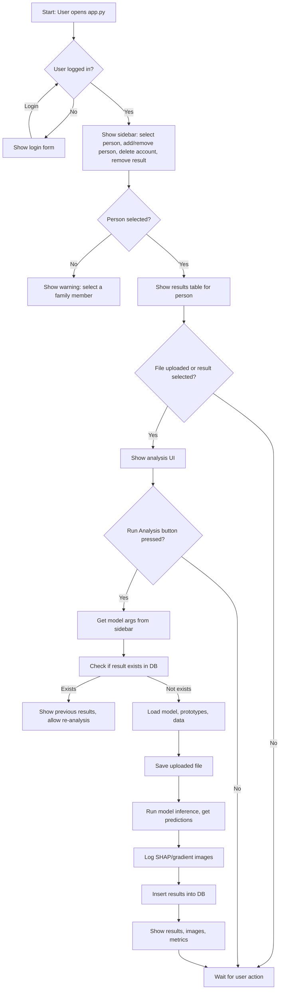
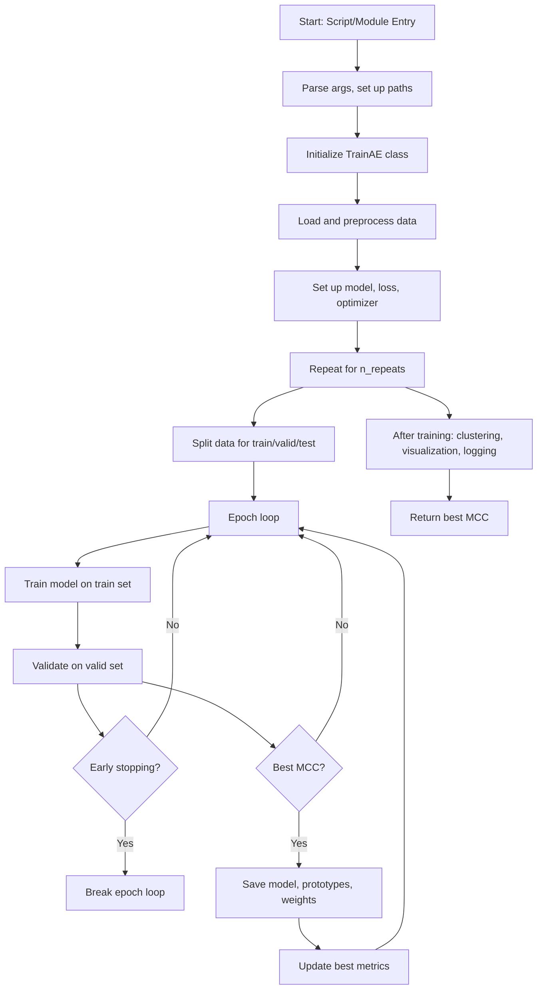

# Otitenet

Use python3.11

python -m pip install -r requirements.txt

python setup.py

make_dataset2.py

train_triplet_new.py

# MLFLOW

ssh -L 8502:localhost:8502 simon@198.168.189.19

streamlit run app.py --server.address 0.0.0.0 --server.port 8502

# make new db
python init_db.py

sudo mysql -u root -p
-- Create the database
CREATE DATABASE results_db;

-- Grant privileges to the user
GRANT ALL PRIVILEGES ON results_db.* TO 'y_user'@'%';

-- Set the user's password
ALTER USER 'y_user'@'%' IDENTIFIED BY 'password';

-- Apply the changes
FLUSH PRIVILEGES;

## Dataset Preprocessing & Transformations (`make_dataset2.py`)

This script processes raw image datasets and creates a unified dataset folder with resized images and a CSV metadata file.

**Transformations applied:**
- **Resize:** All images are resized to a square of the specified size (e.g., 224×224 pixels) using `torchvision.transforms.Resize`.
- **Format conversion:** Images are loaded and saved in their original format (JPG or PNG), but all are resized and copied to the new dataset folder.
- **Filtering:** Only images with the correct extension (`.jpg` or `.png`) and not containing 'Off'/'off' in the filename are included.
- **Stratified split:** The script uses `StratifiedKFold` to assign each image to either the train or test group, ensuring balanced label distribution.

**Output:**
- Resized images in `data/otite_ds_<size>/`
- Metadata CSV: `data/otite_ds_<size>/infos.csv` with columns: `dataset`, `name`, `label`, `group`

## Streamlit App Logic (`app.py`)

## Training Logic (`train_triplet_new.py`)

