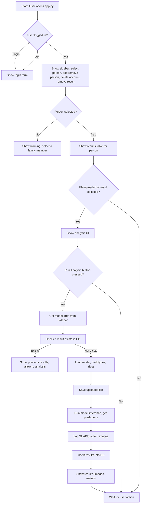
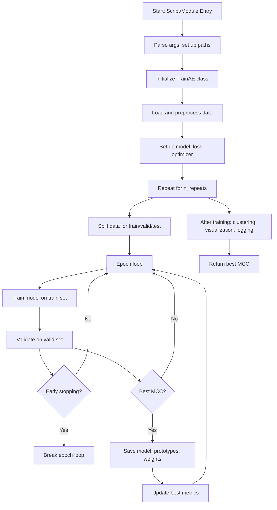

# Otitenet - AI-Powered Otitis Classification

## Project Overview
Otitenet is a framework for domain-generalized otitis classification using Siamese networks (ResNet-18, VGG16, EfficientNet, ViT) with prototype representations, structural regularization, and advanced interpretability (SHAP/Grad-CAM).

## 🚀 Quick Start

### 1. Installation
Ensure you are using **Python 3.11**.
```bash
python -m pip install -r requirements.txt
python setup.py
```

### 2. Database Setup
The system uses MySQL for result tracking. Ensure `results_db` is configured:
```sql
CREATE DATABASE results_db;
GRANT ALL PRIVILEGES ON results_db.* TO 'y_user'@'%' IDENTIFIED BY 'password';
FLUSH PRIVILEGES;
```
Initialize the schema:
```bash
python scripts/utils/init_db.py
```

### 3. Launching Experiments
Use the root bash scripts to manage large-scale runs:
- **`./launch.sh`**: Standard batch execution for the full model grid.
  - `--test`: Run in smoke mode (1 epoch, 1 trial).
  - `--jobs=N`: Limit concurrent jobs.
  - `--force`: Ignore `.done` markers and rerun everything.
- **`./launch_optimize.sh`**: Run hyperparameter optimization.

### 3.1 Dataset Split Control
For deterministic runs (`groupkfold=1`), dataset membership is controlled by batch name.

- `--valid_dataset`: dataset reserved for validation.
- `--test_dataset`: dataset reserved for test. If omitted, the code tries `GMFUNL_jan2023`.
- `--train_datasets`: optional comma-separated list of datasets to use for training.

Default behavior:
- If `--train_datasets` is not provided, all datasets except `valid_dataset` and `test_dataset` are used for training.
- If `--test_dataset` is not found, half of the validation dataset is reassigned to test, and the remaining half stays validation.

Example:
```bash
python -m otitenet.train.train_triplet_new \
  --path=./data/otite_ds_64 \
  --groupkfold=1 \
  --valid_dataset=Banque_Viscaino_Chili_2020 \
  --test_dataset=GMFUNL_jan2023 \
  --train_datasets=Banque_Comert_Turquie_2020_jpg,Banque_Calaman_USA_2020_trie_CM
```

At runtime, the loader prints a split debug summary such as:
```text
[SplitDebug] mode=deterministic valid_dataset=Banque_Viscaino_Chili_2020 test_dataset=GMFUNL_jan2023 train_datasets=['Banque_Comert_Turquie_2020_jpg', 'Banque_Calaman_USA_2020_trie_CM'] fallback_used=False
[SplitDebug] reason=using all samples from explicit test dataset 'GMFUNL_jan2023' counts(train=945, valid=880, test=15)
```

### 3.1.1 Score Semantics and Split Reuse
There are two different validation scores in the project, and they should not be interpreted as the same measurement.

- `best_models_registry.mcc`: the training-time best validation MCC saved by the training loop for the selected run.
- `Learned Embedding Classification` in the Streamlit app: a post-hoc validation MCC computed after loading the saved backbone, encoding the train/valid sets again, and searching over downstream classifiers such as KNN, prototype strategies, and baseline ML models.

Important consequences:

- A discrepancy between these two values is expected even when they use the same validation split, because they are not the same classifier pipeline.
- The embedding section may also use train-time augmentation for the encoded train embeddings via `n_aug`, which can further change the downstream validation MCC.
- The app now reuses saved split manifests from the selected model directory when they exist, so train/valid/test membership matches the original training run instead of being rebuilt heuristically from the current dataset state.

If you need an apples-to-apples check against the registry score, use the app action that recomputes validation MCC with the saved training parameters rather than comparing it to the best score from `Learned Embedding Classification`.

### 3.2 Dataset Preprocessing (Config-Driven)
Raw source datasets should be placed under:
- `data/datasets/<dataset_name>/...`

Preprocessing and dataset assembly are implemented in `src/otitenet/data/make_dataset2.py` and support a separate config file:
- `configs/preprocessing_config.json`

This config controls:
- `source_root`: where raw datasets are read from.
- `output_base`: processed dataset prefix (final folder becomes `output_base_<image_size>`).
- `image_size`: resize target for all exported images.
- `include_datasets`: explicit dataset names to consider.
- `exclude_datasets`: dataset names to ignore even if included.

Example use case:
- include `Banque_Comert_Turquie_2020_jpg`
- exclude `Banque_Comert_Turquie_2020`

Build the processed dataset with:
```bash
python scripts/preprocessing/build_dataset.py --config configs/preprocessing_config.json
```

Output folder example:
- `data/otite_ds_64/`
  - images are resized as part of preprocessing
  - `infos.csv` is generated with `dataset,name,label,group`

To build another size, change `image_size` in the config (for example `224`) and rerun.

### 3.3 Quick Recipe (Recommended)
Use this sequence for the standard production path with `otite_ds_64` and `GMFUNL_jan2023` as test set.

1. Build processed dataset from config:
```bash
python scripts/preprocessing/build_dataset.py --config configs/preprocessing_config.json
```

2. Run training with explicit split control:
```bash
python -m otitenet.train.train_triplet_new \
  --path=./data/otite_ds_64 \
  --groupkfold=1 \
  --valid_dataset=Banque_Viscaino_Chili_2020 \
  --test_dataset=GMFUNL_jan2023 \
  --train_datasets=Banque_Comert_Turquie_2020_jpg,Banque_Calaman_USA_2020_trie_CM \
  --task=notNormal
```

3. Confirm split in logs:
- Look for `[SplitDebug]` lines showing:
  - `test_dataset=GMFUNL_jan2023`
  - `fallback_used=False`

4. Generate paper analysis outputs:
```bash
python scripts/analysis/generate_paper_analysis.py
```

### 4. Running the Application
Full admin/web app:
```bash
streamlit run app.py --server.address 0.0.0.0 --server.port 8502
```

### 4.1 Building the Offline Executable App on Ubuntu
The offline desktop app is separate from the online Streamlit app.

- Online app: `app.py`, with admin or client behavior depending on who logs in.
- Offline app: `app_offline.py`, the minimal client-shaped app with only `New Analysis` and `Historics`.

The offline app packages whatever is in:
```text
data/mobile_deployments/current/
├── manifest.json
└── model.onnx
```

Before building, select the production model in the online app, then refresh the deployment folder:
```bash
python scripts/create_mobile_deployment.py
```

Export that production deployment to quantized ONNX. This is the lightweight production format used by the offline app, so the desktop executable does not need to ship PyTorch:
```bash
python -m pip install -r requirements-export.txt
python scripts/export_offline_onnx_model.py
```

By default this creates a dynamic UINT8 ONNX model. Use `--no-quantize` only if you need a full-precision ONNX file for comparison.

Install the standalone desktop build dependencies:
```bash
python -m pip install -r requirements-desktop.txt
```

`requirements-desktop.txt` is intentionally separate from `requirements.txt`. It uses ONNX Runtime and avoids training, plotting, experiment tracking, tests, and PyTorch packages.

Build the offline Streamlit sidecar executable:
```bash
python -m PyInstaller packaging/pyinstaller/otitenet_streamlit.spec --clean -y
```

The executable is created at:
```bash
dist/otitenet-streamlit/otitenet-streamlit
```

Smoke test it on a free port:

```bash
# Run the offline app (default entrypoint is app_offline.py):
OTITENET_STREAMLIT_PORT=8502 ./dist/otitenet-streamlit/otitenet-streamlit
# Or, explicitly specify the entrypoint (optional, for clarity):
OTITENET_STREAMLIT_PORT=8502 OTITENET_STREAMLIT_APP=app_offline.py ./dist/otitenet-streamlit/otitenet-streamlit
```

If you see an error about `streamlit_app.py` not existing, make sure:
- You are running the `otitenet-streamlit` binary, not `streamlit run ...`
- The file `dist/otitenet-streamlit/_internal/app_offline.py/app_offline.py` exists
- The environment variable `OTITENET_STREAMLIT_APP` is not set to `streamlit_app.py`
- You are not passing extra arguments to the binary

To guarantee a clean run, you can unset the variable first:
```bash
unset OTITENET_STREAMLIT_APP
OTITENET_STREAMLIT_PORT=8502 ./dist/otitenet-streamlit/otitenet-streamlit
```

Then open:
```text
http://127.0.0.1:8502
```

To build the Ubuntu desktop window/installer with Tauri, install Rust first:
```bash
curl --proto '=https' --tlsv1.2 -sSf https://sh.rustup.rs | sh
source "$HOME/.cargo/env"
```

Copy the PyInstaller sidecar into Tauri using your Rust host triplet:
```bash
HOST_TRIPLET="$(rustc -Vv | sed -n 's/^host: //p')"
mkdir -p desktop/src-tauri/binaries
cp dist/otitenet-streamlit/otitenet-streamlit "desktop/src-tauri/binaries/otitenet-streamlit-${HOST_TRIPLET}"
chmod +x "desktop/src-tauri/binaries/otitenet-streamlit-${HOST_TRIPLET}"
```

Build the desktop app:
```bash
cd desktop
npm install
npm run tauri:build
```

The Ubuntu bundle is written under:
```text
desktop/src-tauri/target/release/bundle/
```

See `docs/OFFLINE_DESKTOP.md` for the detailed offline build notes.

## 📂 Project Structure

- **`scripts/`**: Core logic scripts.
  - `analysis/`: SHAP, Grad-CAM, and final publication analysis scripts.
  - `migrations/`: DB schema updates.
  - `utils/`: DB init, model recovery, and common helpers.
  - `debug/`: Tools for isolating Grad-CAM and heatmap issues.
- **`src/otitenet/`**: Primary Python package containing training loops and model architectures.
- **`docs/`**: Detailed documentation, implementation reports, and refactoring history.
- **`output/`**: All generated artifacts.
  - `analysis/`: Final CSV/MD reports (`PAPER_ANALYSIS.md`).
  - `paper_figures/`: Publication-quality plots (`0_dataset_eda.png`, `1_architecture_mcc.png`, etc.).
  - `images/`: General visualizations (PCA/UMAP).
- **`data/storage/`**: persistent storage for `model.pth` and `results.db`.
- **`logs/`**: Experiment logs and `.done` completion markers.

## 📊 Paper Analysis & Results Summary
After training, generate the full publication suite:
```bash
python scripts/analysis/generate_paper_analysis.py
```
Results are consolidated in `output/analysis/`. Key figures in the analysis include:

- **Dataset Characteristics (`0_dataset_eda.png`)**: Overview of class distributions and dataset biases.
- **Architectural Benchmarking (`1_architecture_mcc.png`)**: Performance comparison (MCC) across ResNet, VGG, EfficientNet, and ViT.
- **Structural Regularization (`2_loss_ablation.png` & `3_prototype_ablation.png`)**: Impact of ArcFace vs. Triplet loss and sub-center prototype strategies.
- **Domain Invariance (`4_mcc_vs_entropy.png`)**: Evaluation of model robustness against batch effects.
- **Interpretability Matrix (`6_interpretability.png`)**: Side-by-side comparison of Grad-CAM and SHAP activations for clinical validation.
- **Performance Leaderboard (`7_top_models_table.png`)**: Summary table of the highest-performing configurations.

## 🛠 Internal Workflows

### Streamlit App Logic

```mermaid
flowchart TD
    A[Start: User opens app.py] --> B{User logged in?}
    B -- No --> C[Show login form]
    C -->|Login| B
    B -- Yes --> D[Show sidebar: select person, add/remove person, delete account, remove result]
    D --> E{Person selected?}
    E -- No --> F[Show warning: select a family member]
    E -- Yes --> G[Show results table for person]
    G --> H{File uploaded or result selected?}
    H -- No --> I[Wait for user action]
    H -- Yes --> J[Show analysis UI]
    J --> K{Run Analysis button pressed?}
    K -- No --> I
    K -- Yes --> L[Get model args from sidebar]
    L --> M[Check if result exists in DB]
    M -- Exists --> N[Show previous results, allow re-analysis]
    M -- Not exists --> O[Load model, prototypes, data]
    O --> P[Save uploaded file]
    P --> Q[Run model inference, get predictions]
    Q --> R[Log SHAP/gradient images]
    R --> S[Insert results into DB]
    S --> T[Show results, images, metrics]
    T --> I
```

### Training Pipeline

```mermaid
flowchart TD
    A[Start: Script/Module Entry]
    A --> B[Parse args, set up paths]
    B --> C[Initialize TrainAE class]
    C --> D[Load and preprocess data]
    D --> E[Set up model, loss, optimizer]
    E --> F[Repeat for n_repeats]
    F --> G[Split data for train/valid/test]
    G --> H[Epoch loop]
    H --> I[Train model on train set]
    I --> J[Validate on valid set]
    J --> K{Early stopping?}
    K -- Yes --> L[Break epoch loop]
    K -- No --> H
    J --> M{Best MCC?}
    M -- Yes --> N[Save model, prototypes, weights]
    M -- No --> H
    N --> O[Update best metrics]
    O --> H
    F --> P[After training: clustering, visualization, logging]
    P --> Q[Return best MCC]
```
