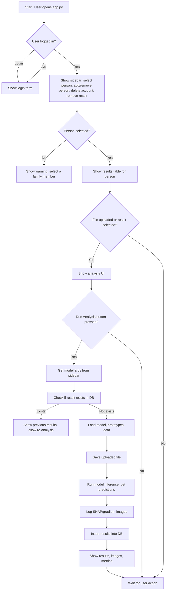
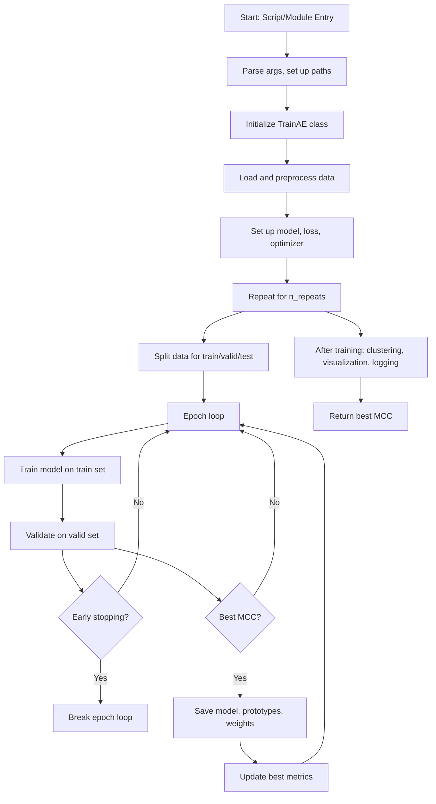

# Otitenet - AI-Powered Otitis Classification

## Project Overview
Otitenet is a framework for domain-generalized otitis classification using Siamese networks (ResNet-18, VGG16, EfficientNet, ViT) with prototype representations, structural regularization, and advanced interpretability (SHAP/Grad-CAM).

## 🚀 Quick Start

### 1. Installation
Ensure you are using **Python 3.11**.
```bash
python -m pip install -r requirements.txt
python setup.py
```

### 2. Database Setup
The system uses MySQL for result tracking. Ensure `results_db` is configured:
```sql
CREATE DATABASE results_db;
GRANT ALL PRIVILEGES ON results_db.* TO 'y_user'@'%' IDENTIFIED BY 'password';
FLUSH PRIVILEGES;
```
Initialize the schema:
```bash
python scripts/utils/init_db.py
```

### 3. Launching Experiments
Use the root bash scripts to manage large-scale runs:
- **`./launch.sh`**: Standard batch execution for the full model grid.
  - `--test`: Run in smoke mode (1 epoch, 1 trial).
  - `--jobs=N`: Limit concurrent jobs.
  - `--force`: Ignore `.done` markers and rerun everything.
- **`./launch_optimize.sh`**: Run hyperparameter optimization.

### 4. Running the Application
```bash
streamlit run app.py --server.address 0.0.0.0 --server.port 8502
```

## 📂 Project Structure

- **`scripts/`**: Core logic scripts.
  - `analysis/`: SHAP, Grad-CAM, and final publication analysis scripts.
  - `migrations/`: DB schema updates.
  - `utils/`: DB init, model recovery, and common helpers.
  - `debug/`: Tools for isolating Grad-CAM and heatmap issues.
- **`otitenet/`**: Primary Python package containing training loops and model architectures.
- **`docs/`**: Detailed documentation, implementation reports, and refactoring history.
- **`output/`**: All generated artifacts.
  - `analysis/`: Final CSV/MD reports (`PAPER_ANALYSIS.md`).
  - `paper_figures/`: Publication-quality plots (`0_dataset_eda.png`, `1_architecture_mcc.png`, etc.).
  - `images/`: General visualizations (PCA/UMAP).
- **`data/storage/`**: persistent storage for `model.pth` and `results.db`.
- **`logs/`**: Experiment logs and `.done` completion markers.

## 📊 Paper Analysis & Results Summary
After training, generate the full publication suite:
```bash
python scripts/analysis/generate_paper_analysis.py
```
Results are consolidated in `output/analysis/`. Key figures in the analysis include:

- **Dataset Characteristics (`0_dataset_eda.png`)**: Overview of class distributions and dataset biases.
- **Architectural Benchmarking (`1_architecture_mcc.png`)**: Performance comparison (MCC) across ResNet, VGG, EfficientNet, and ViT.
- **Structural Regularization (`2_loss_ablation.png` & `3_prototype_ablation.png`)**: Impact of ArcFace vs. Triplet loss and sub-center prototype strategies.
- **Domain Invariance (`4_mcc_vs_entropy.png`)**: Evaluation of model robustness against batch effects.
- **Interpretability Matrix (`6_interpretability.png`)**: Side-by-side comparison of Grad-CAM and SHAP activations for clinical validation.
- **Performance Leaderboard (`7_top_models_table.png`)**: Summary table of the highest-performing configurations.

## 🛠 Internal Workflows

### Streamlit App Logic

```mermaid
flowchart TD
    A[Start: User opens app.py] --> B{User logged in?}
    B -- No --> C[Show login form]
    C -->|Login| B
    B -- Yes --> D[Show sidebar: select person, add/remove person, delete account, remove result]
    D --> E{Person selected?}
    E -- No --> F[Show warning: select a family member]
    E -- Yes --> G[Show results table for person]
    G --> H{File uploaded or result selected?}
    H -- No --> I[Wait for user action]
    H -- Yes --> J[Show analysis UI]
    J --> K{Run Analysis button pressed?}
    K -- No --> I
    K -- Yes --> L[Get model args from sidebar]
    L --> M[Check if result exists in DB]
    M -- Exists --> N[Show previous results, allow re-analysis]
    M -- Not exists --> O[Load model, prototypes, data]
    O --> P[Save uploaded file]
    P --> Q[Run model inference, get predictions]
    Q --> R[Log SHAP/gradient images]
    R --> S[Insert results into DB]
    S --> T[Show results, images, metrics]
    T --> I
```

### Training Pipeline

```mermaid
flowchart TD
    A[Start: Script/Module Entry]
    A --> B[Parse args, set up paths]
    B --> C[Initialize TrainAE class]
    C --> D[Load and preprocess data]
    D --> E[Set up model, loss, optimizer]
    E --> F[Repeat for n_repeats]
    F --> G[Split data for train/valid/test]
    G --> H[Epoch loop]
    H --> I[Train model on train set]
    I --> J[Validate on valid set]
    J --> K{Early stopping?}
    K -- Yes --> L[Break epoch loop]
    K -- No --> H
    J --> M{Best MCC?}
    M -- Yes --> N[Save model, prototypes, weights]
    M -- No --> H
    N --> O[Update best metrics]
    O --> H
    F --> P[After training: clustering, visualization, logging]
    P --> Q[Return best MCC]
```
